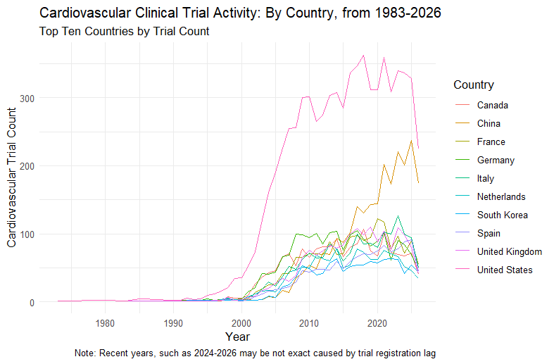

# Cardiovascular Clinical Trial Geography: Where Is Heart Disease Research Actually Happening?

A SQL \+ R analysis of global cardiovascular clinical trial activity, using real data from ClinicalTrials.gov, exploring how research activity is geographically spread and how that distribution has changed over the past four decades.

## The Question

Where do cardiovascular clinical trials take place globally, and does this analysis include all countries or focus on specific regions? This project looks at trial locations by country, provides a global view, and conducts year-to-year analyses to identify which countries lead in cardiovascular research activity and when their growth occurred.

## Data Source

This project uses the **AACT (Aggregate Analysis of ClinicalTrials.gov)** database, a publicly available PostgreSQL database maintained by the Clinical Trials Transformation Initiative (CTTI), a partnership between Duke University and the FDA. While comprehensive, the database may have limitations, such as underreporting or registration delays, which could affect the analysis of global research activity.

## Tools Used

- **SQL (PostgreSQL)** \-\> querying and joining the AACT database directly via pgAdmin  
- **R** \-\> `dplyr` for data wrangling, `ggplot2` for visualization  
- **RStudio** \-\> project organization and analysis

## Methodology

1. **Filtering to cardiovascular trials**: The `conditions` table stores disease/condition names as free text, with significant naming differences (e.g., "Cardiovascular Diseases," "Coronary Artery Disease," and "Cardiac Arrhythmia" all describe cardiovascular conditions but share no exact common string). I used `ILIKE` pattern matching across multiple keyword roots, such as cardiovascular, cardiac, heart, coronary, etc, to capture this variation.  
2. **Joining trial geography and timing**: I joined the filtered condition list to the `facilities` table (trial site locations) and the `studies` table (trial start dates) on each trial's unique `nct_id`.  
3. **Aggregating**: Using `COUNT(DISTINCT nct_id)` and grouping by country and year (to avoid double-counting trials with multiple sites or multiple listed conditions), I built a country-by-year trial count dataset.  
4. **Cleaning**: I excluded trials with missing start dates and excluded implausible future years (post-2026) that reflect registration artifacts rather than real activity.  
5. **Visualizing**: In R, I found the top 10 countries by total trial volume and plotted their year-by-year trial counts.

## Key Findings

- The **United States** dominates cardiovascular trial activity by a wide margin, with a sharp inflection point beginning around 2000, aligning with the establishment of ClinicalTrials.gov and the increased standardization of trial registration.  
- **China** shows a distinct, steep rise in cardiovascular trial activity beginning around 2010, overtaking most of Western Europe and now trailing only the US.  
- **Germany, France, Canada, the UK, and Italy** form a consistent second tier, tracking closely with one another over the past 15 years.  
- The apparent decline in trial counts after 2024, roughly, is most likely not a real drop in research activity. Recent trials may not yet be fully registered or may have future/anticipated start dates, noted in the chart below.

## What I'd Explore Next 

- ## Breaking down trial counts by sponsor type (industry, academic, government) and other variables, such as trial phase, to better understand the characteristics of research activity across regions.

## What I Learned

I believed that when I started this, I would be most surprised with the computational and technical side of working with the programs since I am a beginner, but, truly, the most surprising thing of all for this project was the sheer size of the actual healthcare data and dealing with it\! It is the reality of the clinical world today, but having to take information from it and present findings was both informative and a great introduction to dealing with clinical data in the real world. It felt very good to work with this data and draw conclusions from it, given how vital the information can be and how it is only the beginning of what I intend to explore in the medical data world.

## Project Structure

cardio-trials-project/

├── data/           \# exported CSV from SQL queries

├── scripts/        \# R scripts

├── outputs/         \# saved charts/plots

└── README.md  
